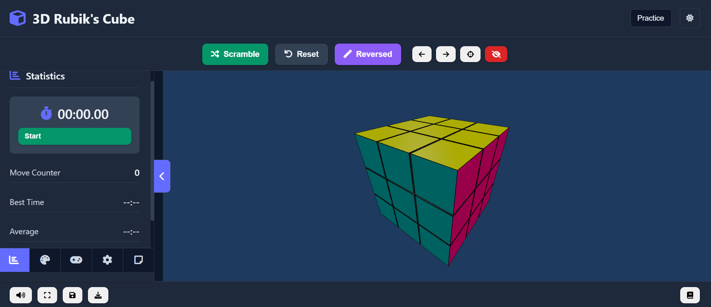

# 3D Rubik's Cube Interactive Simulator

A modern, interactive 3D Rubik's Cube web application built with TypeScript, Three.js, and Vite. This application allows users to interact with multiple virtual Rubik's Cube types (2x2, 3x3, 4x4, and 5x5), practice solving techniques, and track statistics.



## Features

- **Multiple Cube Types**: Support for 2x2, 3x3, 4x4, and 5x5 Rubik's Cubes
- **Fully Interactive 3D Cube**: Rotate faces, layers, and the entire cube in 3D space
- **Multiple Control Methods**: Mouse drag, keyboard shortcuts, and touch support
- **Advanced Notation Support**: 
  - Standard face rotations (F, B, R, L, U, D)
  - Wide moves (Fw/f, Rw/r, etc.) with variable layer counts for 5x5 cube
  - Inner slice rotations (2F, 3R, etc.) for 4x4 and 5x5 cubes
  - Middle layer rotations (M, E, S) for odd-layered cubes
- **Practice & Timer Modes**:
  - Move counter
  - Timer mode
  - Statistics tracking
- **Practice Tools**:
  - Scramble function with cube-size optimized algorithms
  - Undo/Redo moves
  - Reset cube
  - Reversed scramble option
  - Save and load cube state via JSON files
  - Save current state to local storage
- **User Experience**:
  - Light/Dark theme toggle
  - Customizable color themes
  - Responsive design for mobile and desktop
  - Sequence input for executing complex move sequences
  - Cross-device state preservation
- **Visual Aids**:
  - Camera controls
  - Hide/show UI elements

## Tech Stack

- **Frontend**: TypeScript, HTML5, CSS3
- **3D Rendering**: Three.js
- **Build Tool**: Vite
- **Module Bundler**: ES Modules

## Project Structure

```
├── picture/             # Screenshots and images
├── public/              # Static assets
├── src/
│   ├── config/          # Application constants and configuration
│   ├── controllers/     # Input and UI controllers
│   ├── core/            # Core cube logic and 3D scene management
│   │   ├── rotation/    # Rotation logic components
│   ├── examples/        # Example implementations
│   ├── managers/        # State and settings managers
│   ├── services/        # State management and persistence
│   ├── utils/           # Helper utilities
│   ├── main.ts          # Application entry point
│   ├── style.css        # Global styles
│   ├── ui-enhancements.css  # UI-specific styles
│   └── gradient-backgrounds.css # Background gradient styles
└── index.html           # Main HTML entry
```

## Getting Started

### Prerequisites

- Node.js (v14 or newer)
- npm or yarn

### Installation

1. Clone the repository:

   ```bash
   git clone https://github.com/Eggplant203/3D-Rubik-s-Cube-Interactive-Simulator.git
   cd 3D-Rubik-s-Cube-Interactive-Simulator
   ```

2. Install dependencies:

   **Windows:**

   ```bash
   # Run the install.bat script
   install.bat
   ```

   **Linux/Mac:**

   ```bash
   # Make the install script executable and run it
   chmod +x install.sh
   ./install.sh
   ```

   **Manual installation:**

   ```bash
   npm install
   # or
   yarn install
   ```

3. Start the development server:

   ```bash
   npm run dev
   # or
   yarn dev
   ```

4. Open your browser and navigate to `http://localhost:5173`

### Building for Production

```bash
npm run build
# or
yarn build
```

The built files will be in the `dist` directory, ready for deployment.

## How to Use

### Basic Controls

- **Rotate a face**: Click and drag on any face
- **Rotate the entire cube**: Right-click and drag or use middle mouse button
- **Zoom**: Scroll wheel
- **Reset view**: Middle-click or use the reset view button

### Keyboard Shortcuts

Default key mappings (customizable in settings):

- **F**: Rotate front face clockwise
- **B**: Rotate back face clockwise
- **R**: Rotate right face clockwise
- **L**: Rotate left face clockwise
- **U**: Rotate up face clockwise
- **D**: Rotate down face clockwise
- **Hold Shift + any face key**: Rotate counterclockwise
- **M**: Rotate middle layer
- **E**: Rotate equator layer
- **S**: Rotate standing layer
- **X/Y/Z**: Rotate entire cube along X/Y/Z axis

#### Advanced Notation (for 4x4 and 5x5 cubes):
- **2F, 3F, etc.**: Rotate inner slices (2nd layer, 3rd layer)
- **Fw/f, Rw/r, etc.**: Rotate wide slices (double layer turns)
- **3Uw/3u**: Three-layer wide moves for 5x5 cube
- **Sequence Input**: Enter standard notation sequences in the input box

Alternative key mapping presets are available in the settings (QWERTY optimized and left-handed).

## Customization

The application includes extensive customization options:

- **Cube Types**: Switch between 2x2, 3x3, 4x4, and 5x5 cubes
- **Color Themes**: Choose from various color schemes or create custom themes
- **Key Mappings**: Select from different keyboard mapping presets or customize your own
- **Interface Options**: Toggle UI elements visibility and theme
- **Settings Persistence**: Your settings are saved to local storage

## Performance Optimization

The application uses efficient rendering techniques and optimized Three.js implementations to ensure smooth performance even on lower-end devices. The architecture is structured with clean separation of concerns for better maintainability and extensibility.

## Contributing

Contributions are welcome! Please feel free to submit a Pull Request.

## License

This project is licensed under the MIT License - see the LICENSE file for details.

## Acknowledgements

- Three.js for 3D rendering
- Vite for fast development and building
- Font Awesome for UI icons
- CDN libraries for enhanced interface elements

## Author

© 2023-2025 - Developed by Eggplant203 🍆

---

_For detailed technical documentation and advanced options, see the source code comments and mode-specific help tooltips in the application._
